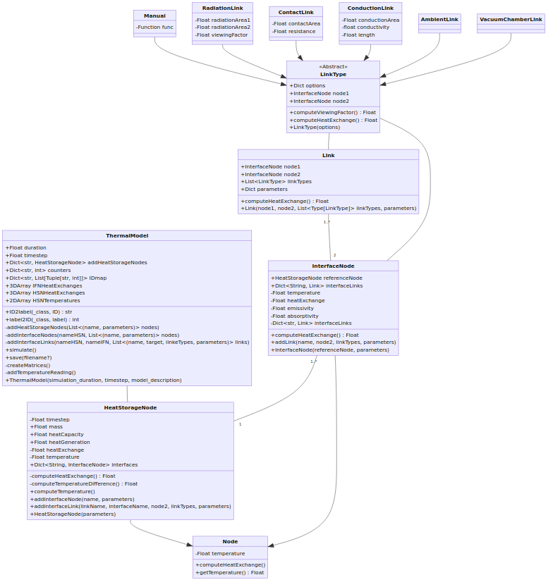

# ISM Thermal Model

This project aims to provide a simple framework to create a thermal model. *More details to be added when ready.*

This is still **WORK IN PROGRESS**. The files in [thermalmodel](./thermalmodel) contain all the classes for the implementation.

The general structure of the various elements is described with the following class diagram.

A sample implementation can be found in [the example file](./example-simulation.py). You will also find the [`example.py`](./example.py) file; please note that this file is not readily usable for the *simulation*. A lot of manual intervention is required here, therefore the wrapper `ThermalModel` class has been created and is used in the simulation example script.

# TODO

You will find many comments saying `TODO` throughout the code. Please look for those to identify any missing elements. Here are the general aspects still missing, in order of priority.

- [x] Add ability to see *missing links* (i.e. those that were not specifically specified). Please refer to [comments in the code](https://github.com/niveK77pur/ISM-Thermal-Model/blob/bfc62ef3e8038fbb5293dbb1494acd61f7a60e79/thermalmodel/thermalmodel.py#L160) for more information.
- [x] [Generate new links](https://github.com/niveK77pur/ISM-Thermal-Model/blob/bfc62ef3e8038fbb5293dbb1494acd61f7a60e79/thermalmodel/thermalmodel.py#L174) for the set of *missing links*. Use the [`links.ManualLink`](https://github.com/niveK77pur/ISM-Thermal-Model/blob/bfc62ef3e8038fbb5293dbb1494acd61f7a60e79/thermalmodel/links.py#L24) type for these; here the heat exchange is "computed" with a user-defined function. For simplicity, make this function compute the heat exchange using the inverse link (i.e. for link `(j,i)`, compute using `(i,j)`)
<!-- - [ ] Make it such that the HSN first only computes the heat exchange for links that are defined. In a second pass, "compute" the heat exchange for links that were not defined (and generated by the code (i.e. they should be identifiable because they only have the `ManualLink` link type; a more robust approach would be to add an attributed indicating whether the links was generated because it was missing or not)). Suggestion: split the `computeHeatExchange()` functions into 2 subfunctions for this task. This is necessary, because you cannot get the heat exchange value of the inverse link if it was not computed yet. Alternatively, run the compute function twice: the first time it might have "missing values" for the inverse links; the second time it will fill up what is missing (but recalculate everything). -->
- [ ] Implement [`AmbientLink`](https://github.com/niveK77pur/ISM-Thermal-Model/blob/bfc62ef3e8038fbb5293dbb1494acd61f7a60e79/thermalmodel/links.py#L90)'s `computeHeatExchange()` function
- [ ] Implement [`VacuumChamberLink`](https://github.com/niveK77pur/ISM-Thermal-Model/blob/bfc62ef3e8038fbb5293dbb1494acd61f7a60e79/thermalmodel/links.py#L100)'s `computeHeatExchange()` function
- [ ] Are temperatures the only relevant thing at the end of the simulation? With the current implementation, there is most likely no need to incorporate complicated matrices (i.e. since the links are now defined both ways (if the above points have been tackled)). If temperatures are all, then store those into arrays for later use, no need for matrices. See [here](https://github.com/niveK77pur/ISM-Thermal-Model/blob/bfc62ef3e8038fbb5293dbb1494acd61f7a60e79/thermalmodel/thermalmodel.py#L120) and [here](https://github.com/niveK77pur/ISM-Thermal-Model/blob/bfc62ef3e8038fbb5293dbb1494acd61f7a60e79/thermalmodel/thermalmodel.py#L199).
- [ ] Implement [`save()`](https://github.com/niveK77pur/ISM-Thermal-Model/blob/bfc62ef3e8038fbb5293dbb1494acd61f7a60e79/thermalmodel/thermalmodel.py#L203) function. Also see [here](https://github.com/niveK77pur/ISM-Thermal-Model/blob/bfc62ef3e8038fbb5293dbb1494acd61f7a60e79/example-simulation.py#L125).
